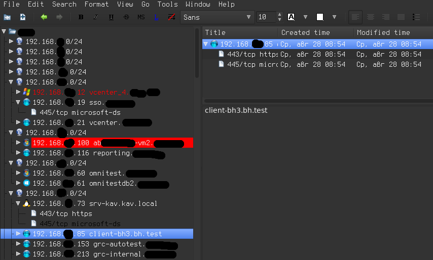

Keepnote_import_metasploit
====================

## Installing

  1. Open your keepnote.
  2. Navigate to "Edit -> Preferences -> Extensions"
  3. Click on "Install new extension" and open the file import_msf.kne.

## Scanning

```
msf> workspace -a test                                                 creating a workspace
msf> hosts -C address,mac,name,os_name,info,comments,vuln_count        set default columns set
msf> db_nmap -Pn -n -p 22,445 --open -iL 192.168.0.0/16 -O             scan and TCP level OS fingerprinting
msf> hosts -R
msf> db_nmap -Pn -sn -iL /tmp/msf-db-rhosts-12345                      dns resolve
msf auxiliary(scanner/netbios/nbname)> run                             netbios resolve
msf auxiliary(scanner/smb/smb_ms17_010)> run                           vulnerability scanning
msf exploit(windows/smb/ms08_067_netapi)> run                          exploitation of vulnerability
msf> hosts 192.168.xx.100 -m owned                                     marked that host has been wned
msf auxiliary(scanner/netbios/nbname)> db_export test.xml              exporting workspace
```

## Exporting
    - Create a new notebook and select this new notebook before importing the XML.
    - Now, navigate to "File -> Import Notebook -> Import Metasploit workspace" and select your XML file
    - After any changes in msf workspace you can export one again. All information will be updated.



## Syntax

```
Subnet/24
`- IP DNS NetBios MAC
   `- port/proto service info
```

All hosts will be grouped in 255.255.255.0 subnets.

If any host has a vulns count value greather than zero it will have foreground color red.

If any host has hacked and `owned/pwned` comment it will have background red.

Filtered and closed ports will be shown grey and black foreground color respectively.
